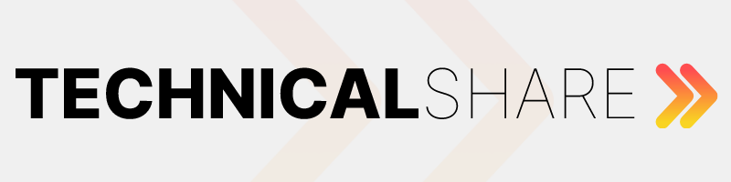

<h1 align="center">
    
</h1>

<h4 align="center"> 
	🍊 TechnicalShare - MVP 🍊
</h4>

<p align="center">
 <a href="#-sobre-o-projeto">Sobre</a> •
 <a href="#-funcionalidades">Funcionalidades</a> •
 <a href="#-layout">Layout</a> • 
 <a href="#-como-executar-o-projeto">Como executar</a> • 
 <a href="#-tecnologias">Tecnologias</a> • 
 <a href="#-equipe">Equipe</a> • 
 <a href="#user-content--licença">Licença</a>
</p>

## 💻 Sobre o projeto

🍊 **TechnicalShare** - é uma plataforma que fornece a possibilidade da empresa cliente registrar e catalogar seus funcionários por áreas de conhecimento e ferramentas mais utilizadas, dando-lhes a possibilidade de se elegerem como "mentores", disponibilizando-se ao contato de outros funcionários que os busquem para tirar dúvidas e fazer networking.

Projeto desenvolvido pelo **Squad 33** durante o Hackaton do **Programa de Formação - Season 3** oferecido pela [FCamara](https://digital.fcamara.com.br/programadeformacao#).

---

## ⚙️ Funcionalidades

- [x] A empresa cliente poderá disponibilizar a plataforma para o cadastro de seus funcionários, fornecendo a possibildade destes cadastrarem:

  - [x] área de conhecimento principal;
  - [x] nível de senioridade dentro da empresa;
  - [x] disponibilidade para dar mentorias;
  - [x] principais links de contato (Linkedin, Whatsapp e Microsoft Teams);
  - [ ] foto de perfil;
  - [ ] edição de perfil;

- [x] Uma vez cadastrados na plataforma, os usuários (funcionários da empresa cliente) poderão acessar a plataforma para:
  - [x] ver uma lista completa de usuários (companheiros de trabalho), com suas informações públicas cadastrais;
  - [x] filtrar a visualização da lista de usuários por área de conhecimento;
  - [x] acessar, através da lista de usuários, a página de perfil interna de cada usuário, para entrar em contato através de um de seus links cadastrados ou por email (se o usuário for um mentor);

* (Outras implementações futuras: autenticação de usuário no login, mais filtros de usuários e novas maneiras de interação.)
---

## 🎨 Layout

O layout da aplicação está disponível no Figma:

<a href="https://www.figma.com/proto/KrEuJnV7qzR88PpdSF6lzp/Entregaveis-Fcamara?node-id=4%3A2833&scaling=min-zoom&page-id=0%3A1&starting-point-node-id=4%3A2833">
  
</a>
<br>
---

## 🚀 Como executar o projeto

Este projeto é divido em duas partes:

1. Backend (<a href="https://github.com/squad33-hackaton/technicalshare-api">Link do Github</a>)
2. Frontend

💡**O Frontend precisa que o Backend esteja sendo executado para funcionar. Acesse o link acima (Link do Github do Backend), siga as instruções para fazer o servidor rodar em sua máquina. Depois retorne às instruções abaixo.**

### Pré-requisitos

Antes de começar, você vai precisar ter instalado em sua máquina as seguintes ferramentas:
[Git](https://git-scm.com), [Node.js](https://nodejs.org/en/).
Além disto é bom ter um editor para trabalhar com o código como [VSCode](https://code.visualstudio.com/)

#### 🧭 Rodando a aplicação web (Frontend)

```bash
# Acesse uma pasta em que queira colocar o projeto, e execute a linha de comando (cmd.exe) ou o Git Bash a partir dela.

# Clone este repositório
$ git clone https://github.com/squad33-hackaton/technicalshare-front.git

# Acesse a pasta do projeto no seu terminal/cmd
$ cd technicalshare-front

# Instale as dependências
$ npm install

# Execute a aplicação em modo de desenvolvimento
$ npm run dev

# A aplicação será aberta na porta:3009 - acesse http://localhost:3009

```

---

## 🛠 Tecnologias

As seguintes ferramentas foram usadas na construção do projeto:

#### **Website** ([NuxtJS](https://nuxtjs.org/)) _O projeto foi criado à partir do comando 'create-nuxt-app', uma CLI de para o NuxtJS que já integra alguns pacotes e funcionalidades no mesmo. Abaixo, as tecnologias marcadas com asterisco são as que foram adicionadas ao projeto desta maneira._

- **[Axios](https://github.com/axios/axios)** \*
- **[Vue Router](https://router.vuejs.org/)** \*

> Veja o arquivo [package.json](https://github.com/squad33-hackaton/technicalshare-front/blob/main/package.json)

#### **Utilitários**

- Layout: **[Bootstrap](https://github.com/axios/axios)** \*, **[sweetalert2](https://sweetalert2.github.io/)**, **[element-ui](https://element.eleme.io/#/en-US)**
- Editor: **[Visual Studio Code](https://code.visualstudio.com/)**
- Protótipo: **[Figma](https://www.figma.com/)** → **[Protótipo (TechnicalShare)](https://www.figma.com/file/1SxgOMojOB2zYT0Mdk28lB/Ecoleta)**
- Teste de API: **[Postman](https://www.postman.com/)**
- Ícones: **[Font Awesome](https://fontawesome.com/)**
- Fontes: **[Manrope](https://fonts.google.com/specimen/Manrope)**

---

## 👨‍💻 Equipe

🧡 O Squad 33 é responsável pelo sucesso na entrega desse projeto. 👏

<h2>Desenvolvedores</h2>
<br>

<br>
<br>
<h2>UX/UI Designers</h2>
<br>

<br>

---

## 📝 Licença

Este projeto esta sobe a licença [MIT](./LICENSE).

---
